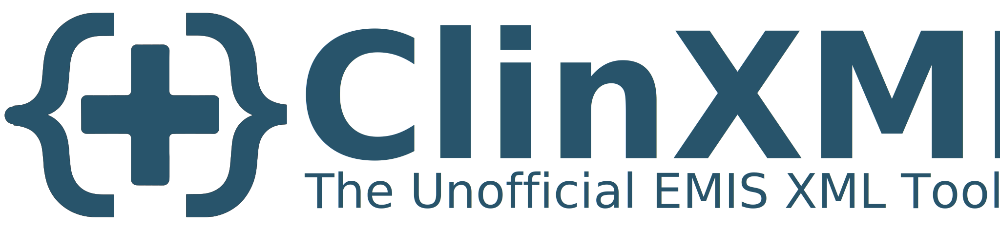
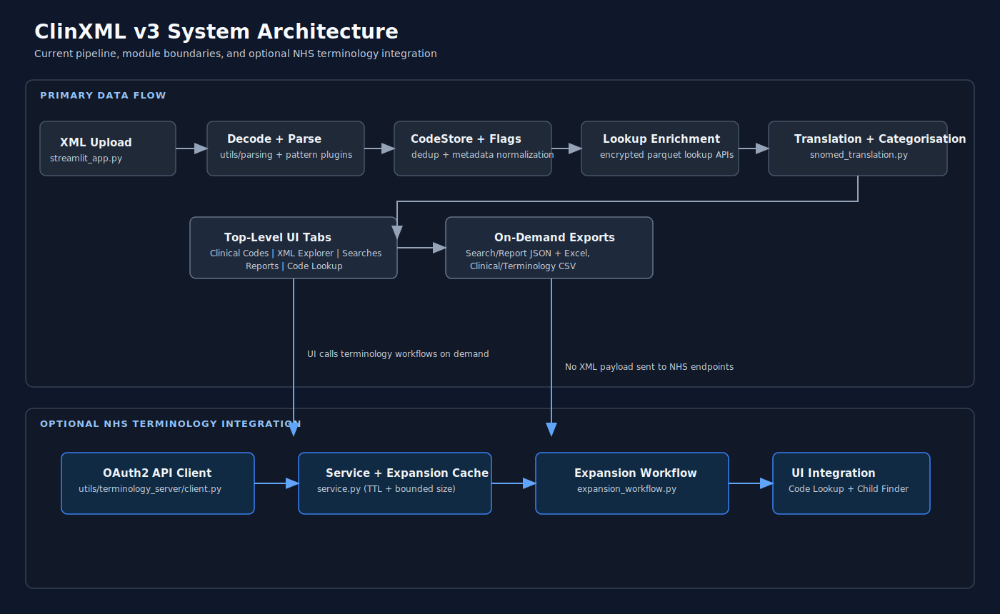

```
© 2026 ClinXML™ — All rights reserved.

This repository and its contents are proprietary. No part of this software,
including source code, documentation, or compiled artifacts, may be copied,
modified, distributed, or used for commercial purposes without explicit
written permission from the author.

ClinXML™ is an unofficial EMIS XML toolkit and is not affiliated with,
endorsed by, or sponsored by Optum Inc, EMIS Health, or any subsidiaries.
All trademarks belong to their respective owners.
```

---

A comprehensive web application for analysing EMIS XML files with advanced search logic analysis, NHS terminology server integration, and clinical code translation.
Transform complex EMIS XML documents into actionable insights for NHS healthcare teams.

## ClinXML At a Glance

| **Feature** | **Capability** | **Benefit** |
|-------------|----------------|-------------|
| **Code Translation** | EMIS GUID to SNOMED via encrypted lookup tables | Instant code translation without external dependencies |
| **NHS API Support** | Optional FHIR R4 hierarchy expansion | Live validation against current NHS terminology |
| **Search Analysis** | Multi-tab interface for all EMIS XML types | Complete visibility into search logic and dependencies |
| **Export System** | Excel, CSV, JSON, XML-ready formats | Ready-to-use outputs for external systems |
| **Performance** | Encrypted parquet caching with filtered lookups | Memory-efficient processing on any device |
| **Security** | Local processing, optional NHS API | XML data never leaves your session |

---

## Key Features

<details>
<summary><strong>Complete Analysis Interface (5 Tabs)</strong></summary>

- **Clinical Codes**: SNOMED translation with deduplication modes and source tracking
  - Summary, Clinical Codes, Medications, RefSets, Pseudo RefSets, Pseudo Members
  - Child Code Finder with NHS terminology expansion
  - Analytics dashboard with processing statistics
- **XML Explorer**: Native file browser with folder navigation and dependency visualisation
- **Searches**: Rule Logic Browser with detailed criterion analysis and exports
- **Reports**: List, Audit, and Aggregate report viewers with structured metadata
- **Code Lookup**: Standalone SNOMED lookup without requiring XML upload

</details>

<details>
<summary><strong>NHS Terminology Server Integration</strong></summary>

- **FHIR R4 API Integration**: Direct connection to NHS England Terminology Server
- **Hierarchical Code Expansion**: Automatic expansion of codes with `includeChildren=true` flags
- **Batch Processing**: Concurrent expansion with adaptive worker scaling
- **Session-based Caching**: Eliminates repeated API calls with intelligent result caching
- **Multiple Export Formats**: CSV with optional XML snippet column for EMIS implementation
- **Individual Code Lookup**: Test and validate codes without uploading XML files

</details>

<details>
<summary><strong>Advanced XML Pattern Support</strong></summary>

- **baseCriteriaGroup**: Nested criterion logic within wrapper criteria
- **Linked Criteria**: Cross-table relationships with temporal constraints
- **SNOMED Refsets**: Direct code handling with clean description extraction
- **EMISINTERNAL Classifications**: Episode types, consultation headings, clinical status
- **Complex Restrictions**: "Latest N WHERE condition" with test attributes
- **Pseudo-Refsets**: Pattern-based identification with dedicated handling

</details>

<details>
<summary><strong>Comprehensive Export System</strong></summary>

- **Lazy Generation**: Export files created only when download button clicked
- **Search Exports**: Excel and JSON with rule logic, criteria, and clinical codes
- **Report Exports**: Excel and JSON for List, Audit, and Aggregate reports
- **Clinical Exports**: CSV with deduplication modes and source attribution
- **NHS Terminology Exports**: Expansion results with optional XML snippet column
- **Context-Sensitive Naming**: Dynamic filenames reflecting content and source

</details>

<details>
<summary><strong>Encrypted Lookup Architecture</strong></summary>

- **Memory Optimisation**: Encrypted bytes stored in session state instead of full DataFrame
- **Fernet Encryption**: AES-128-CBC with HMAC authentication for data integrity
- **Filtered Lookups**: XML processing uses filtered subset of lookup data
- **Automatic Cache Generation**: First load generates encrypted cache from private repo
- **Version Synchronisation**: Lookup version info fetched from source repository

</details>

<details>
<summary><strong>Plugin-Based Parsing</strong></summary>

- **Pattern Plugins**: Modular detectors for XML patterns (restrictions, demographics, temporal filters)
- **Flag Registry**: Centralised flag validation with 95+ canonical flags
- **ElementClassifier**: Unified element classification for searches, reports, and folders
- **Extensible Architecture**: New patterns supported by adding plugins without core changes

</details>

---

## Supported EMIS XML Types

ClinXML supports all standard EMIS XML population manager exports with specialised analysis for each type:

- **Search Reports**: Population-based searches with complex criteria and dependency analysis
- **List Reports**: Multi-column data extraction with healthcare context classification
- **Audit Reports**: Quality monitoring with multi-population analysis and metadata
- **Aggregate Reports**: Statistical analysis with cross-tabulation and enterprise reporting
- **Demographics and LSOA**: Geographic criteria with confidence-based detection

**[Complete XML Pattern Reference](docs/xml-pattern-library/emis-xml-patterns.md)** - Detailed technical patterns and examples

---

## Clinical Code Systems

Translates EMIS GUIDs to SNOMED CT codes with comprehensive system support:

- **SNOMED CT**: Full concept hierarchy with NHS terminology server expansion
- **dm+d Medications**: Dictionary of medicines and devices with brand/generic classifications
- **EMIS Internal**: Episode types, consultation headings, and clinical status codes
- **Legacy Systems**: Read codes via mapping tables for backward compatibility

---

## Quick Start

### Option 1: Use Live App (Recommended)

<details>
<summary>No installation required - <strong><a href="https://clinxml.streamlit.app/">Access Live Application</a></strong></summary>

1. Upload your EMIS XML file
2. View comprehensive analysis across 5 specialised tabs
3. Use NHS terminology server features (credentials pre-configured)
4. Export detailed reports in multiple formats
5. Navigate folder structures and analyse dependencies

</details>

### Option 2: Run Locally

<details>
<summary><strong>Prerequisites and Installation</strong></summary>

#### Prerequisites
- **Python 3.8-3.12** (tested and verified)
- **Dependencies** as specified in requirements.txt

#### Installation
```bash
git clone https://github.com/triplebob/emis-xml-toolkit.git
cd emis-xml-toolkit
pip install -r requirements.txt
```

#### Run Application
```bash
streamlit run streamlit_app.py
```

</details>

<details>
<summary><strong>Configuration (secrets.toml)</strong></summary>

Create `.streamlit/secrets.toml` for full functionality:

**Required for lookup table:**
```toml
GZIP_TOKEN = "your_encryption_password"
```

**Required for first-time cache generation (if no local cache exists):**
```toml
GITHUB_TOKEN = "your_github_token"
LOOKUP_TABLE_URL = "https://raw.githubusercontent.com/.../lookup.parquet"
```

**Optional for NHS terminology features:**
```toml
NHSTSERVER_ID = "Your_Organisation_Consumer_ID"
NHSTSERVER_TOKEN = "your_client_secret_token"
```

</details>

<details>
<summary><strong>Quick Reference Commands</strong></summary>

```bash
# Clone and setup
git clone https://github.com/triplebob/emis-xml-toolkit.git
cd emis-xml-toolkit && pip install -r requirements.txt

# Run locally
streamlit run streamlit_app.py

# Run tests (both test runners)
python -m pytest -q tests
python -m unittest discover tests/

# Run with debug logging
streamlit run streamlit_app.py --logger.level debug
```

</details>

---

## System Architecture

*High-level Overview*



**[Full Interactive Architecture Diagram](docs/architecture/system-architecture-diagram.md)** for complete component details

---

## Project Structure

ClinXML v3 uses a modular `utils/` architecture with clean separation between parsing, metadata, caching, exports, terminology integration, and UI rendering.

**[Complete Project Structure Documentation](docs/project-structure.md)**

### Key Directories
```
utils/
  parsing/              - XML parsing pipeline with element classification
  pattern_plugins/      - Modular pattern detectors and flag emitters
  metadata/             - Code enrichment, flags, and SNOMED translation
  caching/              - Lookup table management and XML caching
  exports/              - Search, report, and clinical code exports
  terminology_server/   - NHS Terminology Server FHIR R4 integration
  ui/                   - Status bar, theme, and tab composition
  system/               - Session state, versioning, and error handling
docs/                   - Technical documentation and architecture guides
tests/                  - Parser, plugin, export, namespace, cache, translation, and performance tests
```

---

## Technical Specifications

<details>
<summary><strong>Performance Optimisations</strong></summary>

- **Encrypted Parquet Cache**: Lookup table stored as encrypted bytes, not full DataFrame
- **Filtered Lookups**: Per-XML subset extraction for enrichment paths
- **Persistent SNOMED Cache**: 60-minute session state cache across XML uploads
- **Lazy Export Generation**: Export files created only when requested
- **Memory Management**: Real-time monitoring with automatic garbage collection
- **Cached Parsing Outputs**: Pipeline and structure outputs cached per XML hash

</details>

<details>
<summary><strong>NHS Terminology Server Integration</strong></summary>

- **FHIR R4 Compliance**: Full NHS England Terminology Server API support
- **OAuth2 Authentication**: System-to-system authentication with thread-safe token management
- **ECL Support**: Expression Constraint Language for hierarchical expansion
- **Adaptive Scaling**: Worker count scales based on workload size
- **Session Caching**: Expansion results cached with TTL and bounded size
- **Rate Limiting**: Graceful handling of API constraints with retry logic

**Lookup Priority:**
```
1. Session Cache      - Instant (if previously fetched)
2. Local Cache        - Fast (encrypted parquet)
3. GitHub API         - Slower (cache generation)
4. NHS API Direct     - For terminology expansion only
```

</details>

<details>
<summary><strong>XML Processing and Data Management</strong></summary>

**XML Processing:**
- **Universal Namespace Handling**: Mixed namespaced/non-namespaced document support
- **Plugin-Based Detection**: Pattern plugins emit structured flags during parsing
- **Flag Validation**: All flags validated against canonical registry definitions
- **Memory Optimisation**: Efficient processing with filtered lookups

**Data Management:**
- **Deduplication Modes**: Unique codes vs per-source tracking
- **CodeStore**: Centralised deduplicated code storage with source attribution
- **Session State Integration**: Persistent analysis across tab navigation
- **Source Attribution**: Track clinical codes to originating searches/reports

**Browser Compatibility:**
- **Chrome/Edge**: Recommended (full feature support)
- **Firefox/Safari**: Supported (core functionality)
- **Mobile**: Limited support (view-only recommended)

</details>

---

## Use Cases

<details>
<summary><strong>Clinical Governance</strong></summary>

- **QOF Indicator Analysis**: Quality and Outcomes Framework reporting
- **Clinical Pathway Review**: Analyse complex care pathways and protocols
- **Code Set Validation**: Verify SNOMED code usage and mapping accuracy
- **Search Logic Auditing**: Review and optimise clinical search criteria
- **Hierarchy Validation**: Compare EMIS expectations with current NHS terminology data

</details>

<details>
<summary><strong>System Administration</strong></summary>

- **EMIS Configuration Review**: Analyse search and report configurations
- **Folder Organisation**: Review hierarchical folder structures
- **Dependency Mapping**: Understand search and report relationships
- **Performance Analysis**: Identify complex searches and optimisation opportunities

</details>

<details>
<summary><strong>Healthcare Analytics</strong></summary>

- **Population Analysis**: Understand search population logic and criteria
- **Report Structure Review**: Analyse List/Audit/Aggregate report configurations
- **Clinical Code Translation**: Convert EMIS codes to SNOMED for external systems
- **Quality Measurement**: Export data for external quality measurement tools

</details>

---

## Security and Privacy

<details>
<summary><strong>Data Handling</strong></summary>

- **No Persistent Storage**: XML files processed in memory only, deleted when session ends
- **Session-based Processing**: All data cleared when browser session terminates
- **Local SNOMED Translation**: Core translation performed using pre-cached lookup tables
- **XML Data Isolation**: Uploaded files remain in user's browser session

</details>

<details>
<summary><strong>NHS API Security</strong></summary>

- **Controlled API Usage**: Only NHS Terminology Server accessed (optional) for:
  - Individual SNOMED code validation
  - Hierarchical code expansion
  - Parent-child relationship verification
- **API Data Scope**: Only SNOMED codes sent to NHS API, not XML content
- **OAuth2 Authentication**: System-to-system authentication with secure credential handling
- **No XML Transmission**: Patient data and XML content never sent to external APIs

</details>

<details>
<summary><strong>Compliance Considerations</strong></summary>

- **IG Toolkit Compatible**: Designed for NHS IG Toolkit compliance
- **GDPR Aligned**: No persistent data storage or tracking
- **Audit Trail**: Processing statistics available for governance
- **Version Transparency**: Lookup table versions clearly displayed
- **NHS Terms Compliance**: Usage subject to NHS England API terms of service

</details>

---

## Support and Documentation

**[Complete Documentation Hub](docs/)** with technical guides:

- [Project Structure](docs/project-structure.md) - Directory organisation
- [Module Architecture](docs/architecture/modules.md) - System design
- [Test Suite Reference](docs/architecture/testing.md) - Test coverage and patterns
- [NHS Integration](docs/terminology-server/term-server-overview.md) - Terminology server guide
- [XML Patterns](docs/xml-pattern-library/emis-xml-patterns.md) - Technical patterns
- [Flags and Plugins](docs/flags-and-plugins/flags.md) - Flag system reference
- [Session State](docs/architecture/session-state-management.md) - State management
- [Namespace Handling](docs/architecture/namespace-handling.md) - XML processing

---

## License and Usage

**Disclaimer:** EMIS and EMIS Web are trademarks of Optum Inc.  
This unofficial toolkit is not affiliated with, endorsed by, or sponsored by Optum Inc, EMIS Health, NHS England, or any subsidiaries.  
All trademarks belong to their respective owners.

This software is proprietary and part of the ClinXML™ family of tools.

The official licensing terms for the ClinXML Toolkit are published in the ClinXML Legal repository:

- [**EULA**](https://github.com/triplebob/clinxml-legal/blob/main/EULA-clinxml.md)
- [**License**](https://github.com/triplebob/clinxml-legal/blob/main/LICENSE-clinxml.md)

**No Warranty:** All clinical code translations, mappings, and outputs must be independently validated before clinical use.  
Users accept full responsibility for any decisions made using this toolkit.


---

*Last Updated: 4th February 2026*
*Application Version: [3.0.1](changelog.md) - [View Release Notes](changelog.md)*
