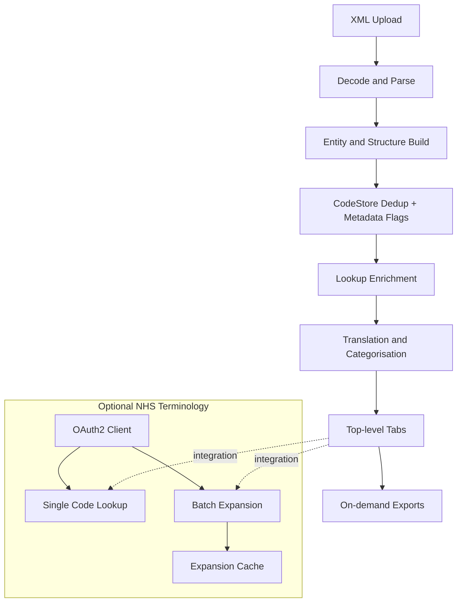
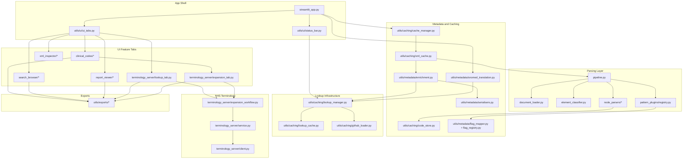

# ClinXML System Architecture

## Overview

This document describes the current v3 architecture and data flow from XML upload to UI rendering and exports.

## High-Level Flow



## Detailed Component Diagram



## Runtime Sequence (Typical Upload)

```text
1. User uploads XML in streamlit_app.py
2. cache_manager.cache_xml_code_extraction() requests cached parse results
3. xml_cache.cache_parsed_xml() runs parsing pipeline (or returns cache hit)
4. metadata enrichment builds UI-ready rows
5. streamlit_app.py runs translation categorisation for clinical outputs
6. ui_tabs.py renders top-level tabs and feature-specific views
7. Export payloads are generated only when export buttons are clicked
```

## Top-Level UI Tabs

Processed-file mode:

1. Clinical Codes
2. XML Explorer
3. Searches
4. Reports
5. Code Lookup

Debug mode additionally exposes a Memory diagnostics tab.

## Caching Summary

- Lookup bytes cached in session state (`LOOKUP_ENCRYPTED_BYTES`)
- Parsed XML outputs cached by XML hash (`cache_parsed_xml`)
- SNOMED mapping cache maintained with 60-minute TTL
- Terminology expansion cache uses TTL + bounded eviction
- Export payloads are generated lazily and released after download actions

---

*Last Updated: 3rd February 2026*
*Application Version: 3.0.0*
