# ClinXML System Architecture

## Overview

This document provides a visual overview of the ClinXML system architecture, showing the data flow from XML upload through processing to the final 5-tab user interface and export system.

## High-Level System Overview

For new contributors, here's a simplified view of the core system flow:

```mermaid
graph TB
    XML[📄 XML Upload] 
    PARSE[🔧 XML Processing<br/>Extract GUIDs & Structure]
    TRANS[🔄 Translation<br/>EMIS → SNOMED]
    UI[📊 5-Tab Interface<br/>Display Results]
    EXPORT[📤 Export System<br/>Multiple Formats]
    
    XML --> PARSE
    PARSE --> TRANS
    TRANS --> UI
    UI --> EXPORT
    
    subgraph "Optional NHS Integration"
        NHS[🌐 NHS Terminology<br/>Hierarchy Expansion]
    end
    
    TRANS -.-> NHS
    NHS -.-> UI
    
    classDef core fill:#e8f5e8
    classDef optional fill:#e3f2fd
    
    class XML,PARSE,TRANS,UI,EXPORT core
    class NHS optional
```

## Detailed System Architecture

## Error Handling Flow

```mermaid
graph TB
    ParseErr[❌ XML Parse Error<br/>malformed XML]
    TransErr[❌ Translation Error<br/>lookup failure]
    APIErr[❌ NHS API Error<br/>auth/network failure]
    
    EH[🛡️ error_handling.py<br/>Centralized Error Management]
    UEH[📱 ui_error_handling.py<br/>User-Friendly Display]
    
    ParseErr --> EH
    TransErr --> EH
    APIErr --> EH
    
    EH --> UEH
    
    subgraph "Error Recovery"
        Cache[💾 Fallback to Cache]
        Graceful[⚠️ Graceful Degradation]
        UserMsg[💬 User Guidance]
    end
    
    EH --> Cache
    EH --> Graceful
    UEH --> UserMsg
    
    classDef error fill:#ffebee
    classDef recovery fill:#e8f5e8
    classDef handler fill:#fff3e0
    
    class ParseErr,TransErr,APIErr error
    class Cache,Graceful,UserMsg recovery
    class EH,UEH handler
```

## Component Descriptions

### Input Layer
- **EMIS XML File**: Source EMIS XML documents (Search, List, Audit, Aggregate reports)

### XML Processing Pipeline
- **Namespace Handler** (`namespace_handler.py`): Universal support for mixed namespaced/non-namespaced XML
- **Base Parser** (`base_parser.py`): Defensive programming patterns with structured error handling
- **Criterion Parser** (`criterion_parser.py`): Search logic and criteria parsing
- **Report Parser** (`report_parser.py`): List/Audit/Aggregate report structures
- **Value Set Parser** (`value_set_parser.py`): Clinical code value sets with deduplication
- **XML Utils** (`xml_utils.py`): Core GUID extraction with source attribution

### Core Translation Engine
- **Translator** (`translator.py`): Main EMIS GUID → SNOMED translation engine with dual-mode deduplication
- **Multi-tier Caching**: Session cache (60min) → GitHub cache → NHS API fallback strategy
- **Performance**: O(1) dictionary lookups with session state persistence and cache_manager integration

### Analysis Pipeline
- **Analysis Orchestrator** (`analysis_orchestrator.py`): Coordinates workflow across specialized analyzers
- **XML Element Classifier** (`xml_element_classifier.py`): Single XML parse with element type classification
- **Search Analyzer** (`search_analyzer.py`): Population logic, linked criteria, and dependency analysis
- **Report Analyzer** (`report_analyzer.py`): Structure analysis for List/Audit/Aggregate reports

### 5-Tab User Interface
- **Clinical Codes** (`clinical_tabs.py`): SNOMED translation with dual-mode deduplication
- **Search Analysis** (`analysis_tabs.py`): Rule Logic Browser with criteria visualization
- **List Reports** (`list_report_tab.py`): Column structure analysis with healthcare context
- **Audit Reports** (`audit_report_tab.py`): Multi-population analysis with quality indicators
- **Aggregate Reports** (`aggregate_report_tab.py`): Statistical analysis with cross-tabulation

### Export System
- **Export Manager** (`ui_export_manager.py`): Coordinates multiple export formats
- **Search Export** (`search_export.py`): Rule breakdown and criteria analysis
- **Report Export** (`report_export.py`): All report types with enhanced metadata
- **Clinical Export** (`clinical_code_export.py`): SNOMED codes with source tracking
- **JSON Export** (`json_export_generator.py`): API integration and structured data
- **Terminology Export** (`terminology_export.py`): NHS hierarchy formats

### NHS Terminology Server Integration
- **Terminology Client**: OAuth2 authentication with FHIR R4 API
- **Rate Limiter**: Adaptive throttling with exponential backoff
- **Progress Tracker**: Real-time updates with adaptive time estimation
- **Batch Processor**: Concurrent workers (8-20) for large hierarchies
- **Expansion Service**: SNOMED hierarchy expansion with `includeChildren=true`

## Data Flow Summary

1. **XML Upload** → XML processing pipeline extracts GUIDs and structure
2. **Translation** → Core engine translates GUIDs to SNOMED using cached lookups
3. **Analysis** → Specialized analyzers process search logic and report structure
4. **UI Display** → 5-tab interface presents organized results with export options
5. **NHS Integration** → Optional terminology server provides live hierarchy validation

## Performance Characteristics

- **Session Caching**: 60-minute SNOMED mapping persistence
- **Adaptive Threading**: 8-20 workers based on workload size
- **Memory Optimization**: Streamlit Cloud compatible (2.7GB limits)
- **Progressive Loading**: Section-by-section rendering for large datasets
- **Cache-first Strategy**: Minimizes external API dependencies

## Security & Privacy

- **Local Processing**: XML files processed in browser session only
- **Controlled API Usage**: Only SNOMED codes sent to NHS API (not XML content)
- **OAuth2 Security**: System-to-system authentication for NHS API
- **No Persistent Storage**: All data cleared when session ends